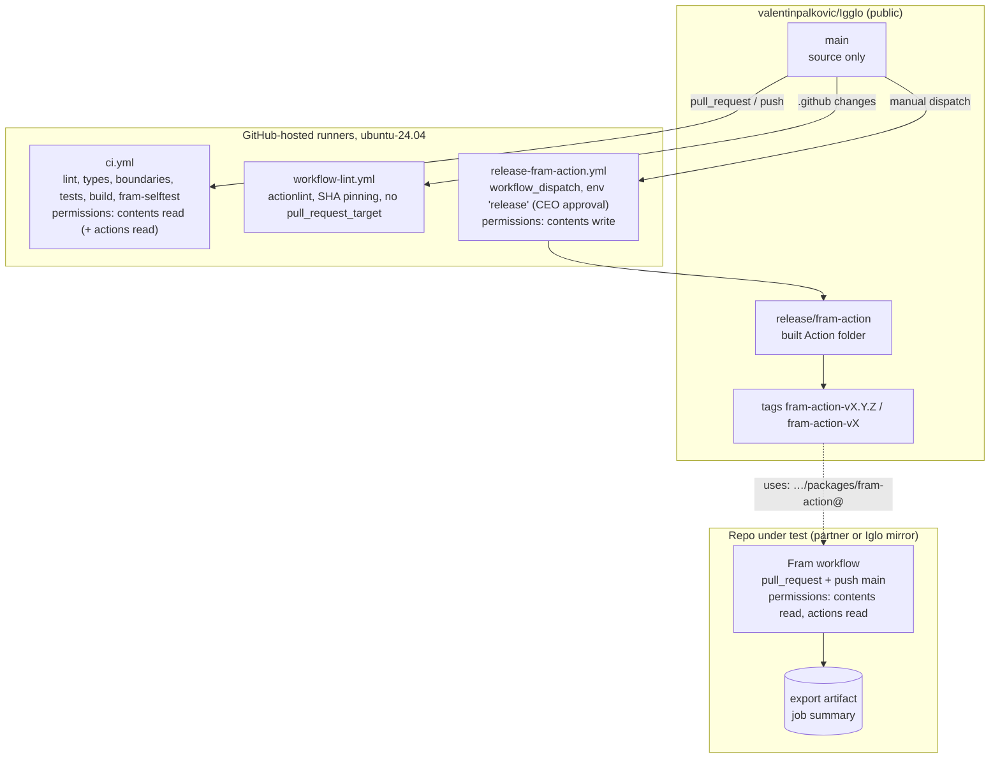

# Deployment

Source: [ADR-006](adr/006-ci-cd.md). CI and release only. Hosting (Cloudflare, Railway) is added when ADR-005 is accepted. The Fram MVP has no Iglo-hosted parts.

```mermaid
flowchart TB
  subgraph igglo["valentinpalkovic/Igglo (public)"]
    main["main<br/>source only"]
    rel["release/fram-action<br/>built Action folder"]
    tags["tags fram-action-vX.Y.Z / fram-action-vX"]
  end

  subgraph gha["GitHub-hosted runners, ubuntu-24.04"]
    ci["ci.yml<br/>lint, types, boundaries, tests, build, fram-selftest<br/>permissions: contents read (+ actions read)"]
    wl["workflow-lint.yml<br/>actionlint, SHA pinning, no pull_request_target"]
    release["release-fram-action.yml<br/>workflow_dispatch, env 'release' (CEO approval)<br/>permissions: contents write"]
  end

  subgraph partner["Repo under test (partner or Iglo mirror)"]
    wf["Fram workflow<br/>pull_request + push main<br/>permissions: contents read, actions read"]
    art[("export artifact<br/>job summary")]
  end

  main -- "pull_request / push" --> ci
  main -- ".github changes" --> wl
  main -- "manual dispatch" --> release
  release --> rel --> tags
  tags -. "uses: …/packages/fram-action@<sha>" .-> wf
  wf --> art
```
